scRNA-Seq Forum
========================================================
date: 29.07.2017
author: Jens Kleinjung, jens.kleinjung@crick.ac.uk
width: 1920
height: 1080
font-family: 'Helvetica'
navigation: slide
transition: none
transition: rotate
transition-speed: slow
incremental: true

[https://github.com/jkleinj/scRNA-Seq_forum](https://github.com/jkleinj/scRNA-Seq_forum)


Programme
========================================================

```
15:00 Introduction
```

- 15:05 Sample preparation from tissue. *Reena Lasrado*
- 15:20 Sample preparation from culture. *Andreas Sagner*
- 15:35 Sequencing of single-cell samples. *Marta Costa*

```
15:50 Break
```

- 16:00 10X Genomics. *Scott Brouilette*
- 16:15 Post-processing of single-cell RNA-Seq data. *Jens Kleinjung*
- 16:30 Pseudo-time analysis and lineage reconstruction. *Julien Delile*

```
- 16:45 Discussion
- 17:00 Refreshments, kindly sponsored by 10X Genomics
```


Introduction
========================================================
## Single-cell RNA-Seq Publications

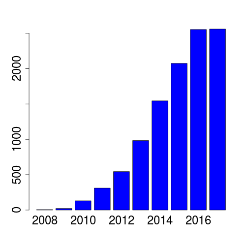

<small>
[Keystone Symposia: Single Cell Omics (E3)](https://www.keystonesymposia.org/17e3)
```
Design and computational analysis of single-cell RNA-sequencing experiments.
Rhonda Bacher and Christina Kendziorski, Genome Biology 17 (2016) 63.
```
```
The Technology and Biology of Single-Cell RNA Sequencing.
Kolodziejczyk et al., Molecular Cell 58 (2015) 610.
```
</small>

***

## Lineage-specific Mapping and (Pseudo-)Time Reconstruction
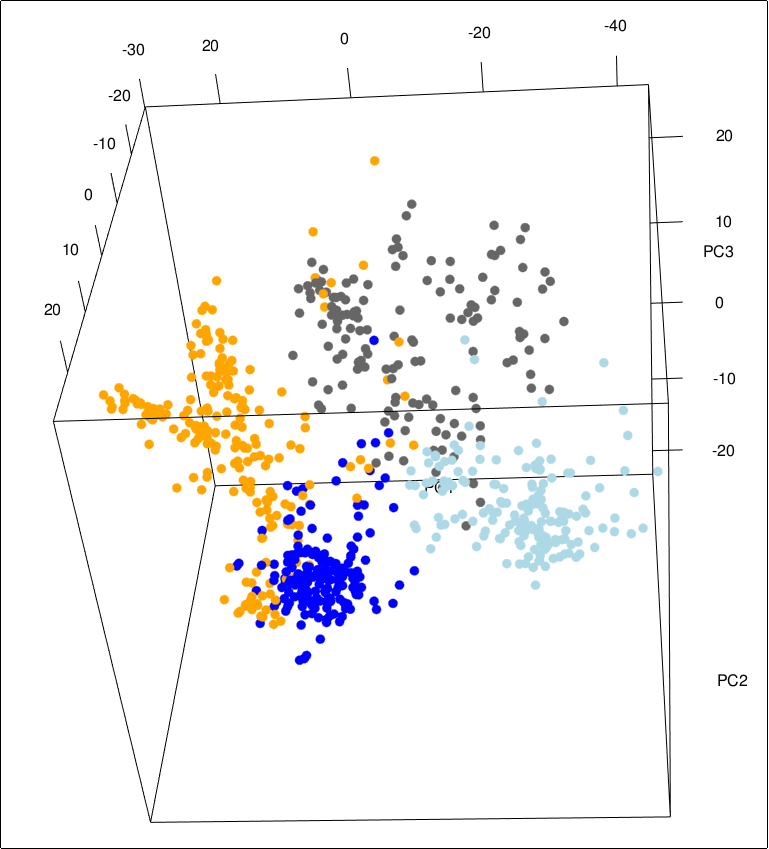


RNA-Seq Data Pipeline
========================================================
## Prerequisites
* Aligner
* Reference genome or transcriptome; ERCC92 references
* Single-cell RNA-Seq transcript reads

## Alignment
* Align each sample (cell) on cluster or local computer
* Count transcripts
* Log alignment success
* Merge all samples into one result table (transcript counts)

## Quality Check
* Quality-check all samples

## Normalisation
* Normalise samples and batches

## Analysis
* Create PCA and tSNE plots
* Analyse differential gene expression


Quality Control and Normalisation
========================================================
## Quality Control
- Check the distribution of read counts
- Remove all cells with 'total transcript counts < cut-off'
  (~50000, but other methods might have lower counts)
- Remove all genes with less than 5 counts in 5 samples
- Number of remaining genes >5000?
- <10% of transcripts map to mitochondrial genes

## Normalisation
- Dispersion of transcript counts is a result of biological variation and technical noise
- The challenge of (sc)RNA-Seq normalisation is to remove only the technical noise
- Incomplete normalisation leads to false signals in differential expression analysis
- Excessive normalisation reduces or removes the biological signal


Quality Control Example
========================================================

```
                    A11   A12  B01 B02  B03  B06  B09  B10  B11   B12
ENSMUSG00000000001  559     1   90   5    6  132  596  902 1072  3361
ENSMUSG00000000003    0     0    0   0    0    0    0    0    0     0
ENSMUSG00000000028    0     0    0   0    0    0    2   41  145     1
ENSMUSG00000000031    3   169 1247   5   50 1824   75  515  848  7280
ENSMUSG00000000037    0     0    0   0    0    0    0    0    0     0
ENSMUSG00000000049    0     0    0   0    0    0    0    0    0     0
ENSMUSG00000000056    1     6    2   0 2908    3  614    0    1     0
ENSMUSG00000000058    0     0    0   0    0    0    0    0    0     0
ENSMUSG00000000078   22    21  107   0  725 1237  211  161 1517     5
ENSMUSG00000000085    6     3    0   3   32   53    1    0   23   878
ENSMUSG00000000088   62    12  111   0   75  115  196  173   20     1
ENSMUSG00000000093  198     0    0   0    0   17    0    0   56     0
ENSMUSG00000000094    0     0    0   0    0    0    0    0    0     0
ENSMUSG00000000103    0     0    0   0    0    0    0    0    0     0
ENSMUSG00000000120    8   247   40   0    1   84   16    8    5     2
ERCC-00158            0     0    0   0    0    0    0    0    0     0
ERCC-00160            2     1    1   1  573    8    1    2    0     0
ERCC-00162           22   579   49   0  114    0    3    0   13   337
ERCC-00163            0   578    0   0    0   19   31    1    0    48
ERCC-00164            0     0    0   0    0    0    0    0    0     0
ERCC-00165          752   602    0   0    0  115   65  397    3     1
ERCC-00168            0     0    0   0    0    0    0    0    0     0
ERCC-00170           78     1    0   0   23    2    0    0    0     0
ERCC-00171         8092 16075 3142  36 5457 2331 3879 5551 2468 18893
```


```
                    A11   A12  B01 B02  B03  B06  B09  B10  B11   B12
Total read counts  9805 18295 4789  50 9964 5940 5690 7751 6171 30807
```

========================================================
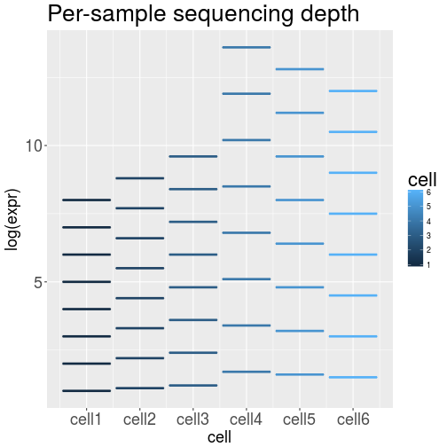

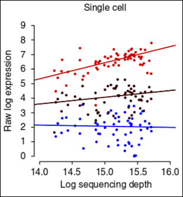
<small>
Bacher et al., Nature Methods 14 (2017) 584.
</small>
***
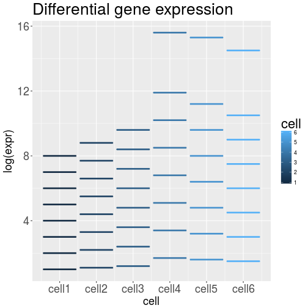

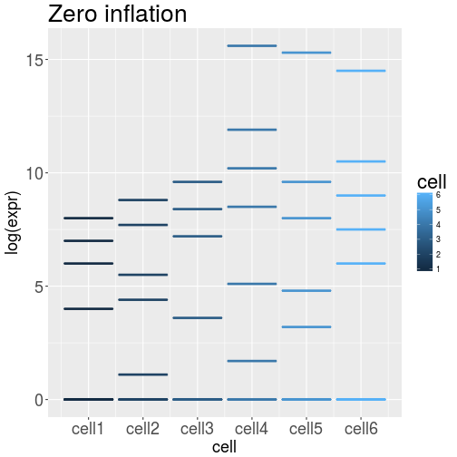


<small>
Bacher et al., Nature Methods 14 (2017) 584.
</small>


Normalisation Example: SCnorm
========================================================
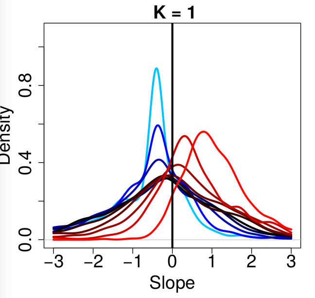
***
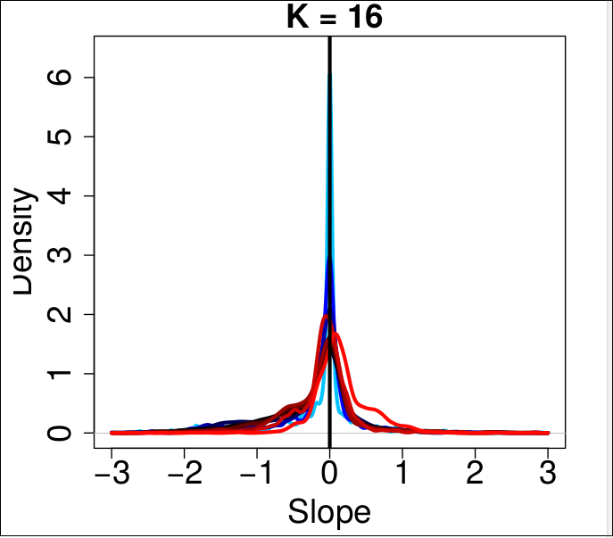


Normalisation Example: RUVSeq
========================================================
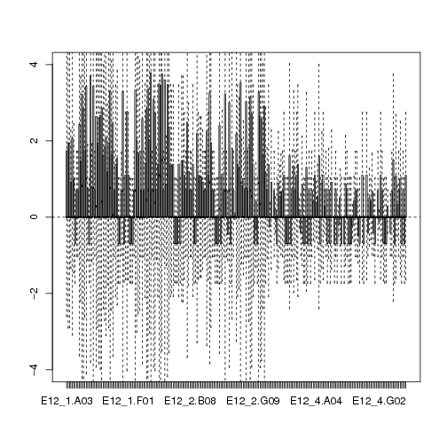
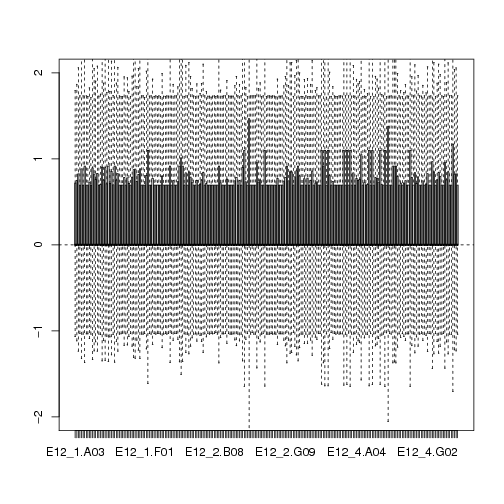
***
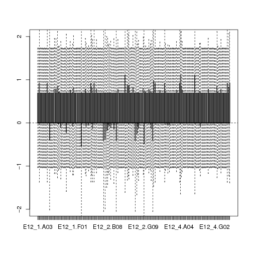


Latent Factors
========================================================
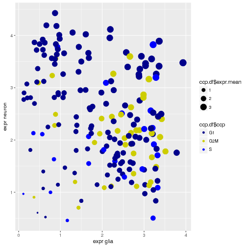

***

* Package scran: assignment of cell cycle phase
* Package scLVM: removal of latent factors (such as cell cycle effects)


(Semi-)Supervised Analysis
========================================================
- Currently there is no fully automated analysis of biological processes!
  We can map to GO terms, pathways, gene modules and more,
  but the understanding comes from the exchange: Biology <=> Bioinformatics.
  Be nice to us Bioinformaticians (chocolate helps), you still need us!

## Differential gene expression
  - two-dimensional clustering (heatmap)
  - gene lists via correlation or regression models

## Analysis of the covariance matrix
  - PCA, tSNE
  - Latent factor analysis (scran, scLVM)
  - Pseudo-time as latent factor (Monocle, Wanderlust, DeLorean)
  - Branching trajectories


========================================================
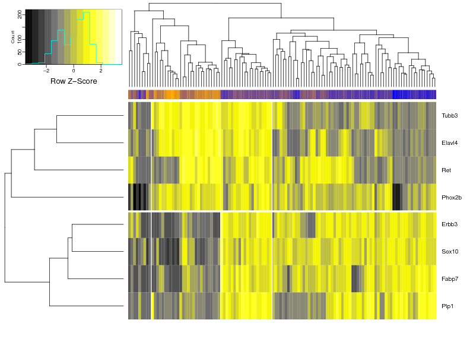
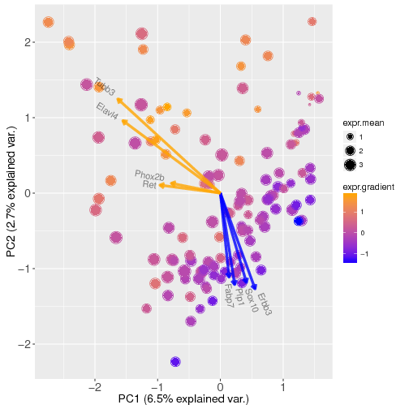
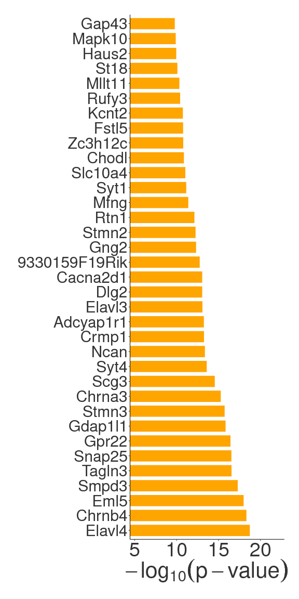
***
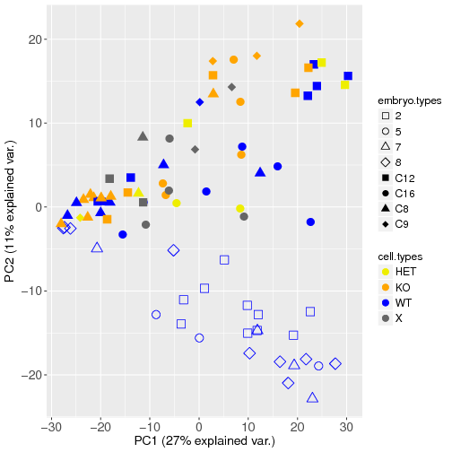

```
Lineage-dependent spatial and functional organization of the mammalian enteric nervous system.
Lasrado, ..., Pachnis (2017) Science 356, 722-726.
```
```
Genome editing reveals a role for OCT4 in human embryogenesis.
Fogarty, ..., Niakan (Sep. 2017) Nature.
```
```
A Gene Regulatory Network Balances Neural and Mesoderm Specification during Vertebrate Trunk Development.
Gouti, ..., Briscoe (2017) Dev. Cell 41, 243.
```


