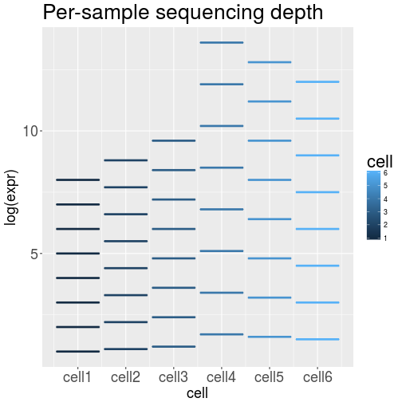

scRNA-Seq Forum
========================================================
date: 29.07.2017
author: Jens Kleinjung, jens.kleinjung@crick.ac.uk
width: 1920
height: 1080
font-family: 'Helvetica'
navigation: slide
transition: none
transition: rotate
transition-speed: slow
#incremental: true

[https://github.com/jkleinj/scRNA-Seq_forum](https://github.com/jkleinj/scRNA-Seq_forum)


Programme
========================================================

```
15:00 Introduction
```

- 15:05 Sample preparation from tissue. *Reena Lasrado*
- 15:20 Sample preparation from culture. *Andreas Sagner*
- 15:35 Sequencing of single-cell samples. *Marta Costa*

```
15:50 Break
```

- 16:00 10X Genomics. *Scott Brouilette*
- 16:15 Post-processing of single-cell RNA-Seq data. *Jens Kleinjung*
- 16:30 Pseudo-time analysis and lineage reconstruction. *Julien Delile*

```
- 16:45 Discussion
- 17:00 Refreshments, kindly sponsored by 10X Genomics
```


Introduction
========================================================
## Single-cell RNA-Seq Publications


<small>
[Keystone Symposia: Single Cell Omics (E3)](https://www.keystonesymposia.org/17e3)
```
Design and computational analysis of single-cell RNA-sequencing experiments.
Rhonda Bacher and Christina Kendziorski, Genome Biology 17 (2016) 63.
```
```
The Technology and Biology of Single-Cell RNA Sequencing.
Kolodziejczyk et al., Molecular Cell 58 (2015) 610.
```
</small>

***

## Lineage-specific Mapping and (Pseudo-)Time Reconstruction


RNA-Seq Data Pipeline
========================================================
## Prerequisites
* Aligner
* Reference genome or transcriptome; ERCC92 references
* Single-cell RNA-Seq transcript reads

## Alignment
* Align each sample (cell) on cluster or local computer
* Count transcripts
* Log alignment success
* Merge all samples into one result table (transcript counts)

## Quality Check
* Quality-check all samples

## Normalisation
* Normalise samples and batches

## Analysis
* Create PCA and tSNE plots
* Analyse differential gene expression


Quality Control
========================================================
- Check the distribution of read counts
- Remove all cells with 'total transcript counts < cut-off'
  (~50000, but other methods might have lower counts)
- Remove all genes with less than 5 counts in 5 samples
- Number of remaining genes >5000?
- <10% of transcripts map to mitochondrial genes


Quality Control Example
========================================================


========================================================



***


<small>
Bacher et al., Nature Methods 14 (2017) 584.
</small>


Normalisation Example
========================================================


Latent Factors
========================================================


(Semi-)Supervised Analysis
========================================================
- Currently there is no fully automated analysis of biological processes!
  We can map to GO terms, pathways, gene modules and more,
  but the understanding comes from the exchange: Biology <=> Bioinformatics.
  Be nice to Bioinformaticians (chocolate helps)!
  
1. Differential gene expression
  (contrast between pairs of design groups)
  - two-dimensional clustering (heatmap)
  - gene lists via correlation or regression models


2. Analysis of the covariance matrix
  - PCA, tSNE
  - Latent factor analysis (scLVM, scran)
  - Pseudo-time as latent factor (Monocle, Wanderlust, DeLorean)
  - Branching trajectories

